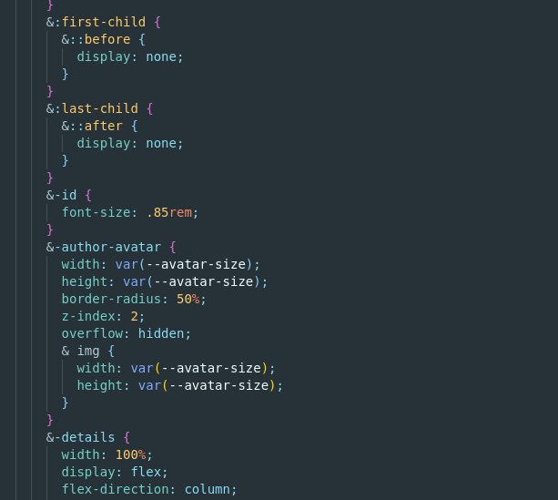

# _SMS Buddy_
Automate your 
Sending sms from your app
## Providers
Nexmo
Twilio
Smm gateway

# Summary
- Context
  * The problem
  * The solution  
- What is a Sms gateway ?
- Next up
- Wrap up

# Context
I knew a lot of entrepreneurs in my country (Senegal) use their personnal phone number to send business related sms. Since in the past, I built something similar for a customer I thought it would be a great idea to cheer and support the florishing businesses that I liked already.
Besides, sharing is caring so I'll work you through the development of this solution.

## The problem
- manual labour
- not scalable (sustainable) with customer base. Think a hundred, a thousand, ten of thousands
[insert:meme overload]

## The solution  
How it works:
- select recipient phone number
- input your text
- send

- use web technologies to send bulk sms
  * sms gateway
- Features: 
  * send sms from the computer
  * support multiple recipients
  * support csv file with custom fields 
    [insert:name, phone_number, order_count]

# What is a Sms gateway ?

# Src
## Dependencies
- papaparse: parse csv file to matrice (array of array)
- axios: for http(s) request
- sweetalert2: because we like candies!
[insert:meme no. more seriously]
- sweetalert2: better modal dialog
- node-sass, sass-loader to compile scss because I like nesting

# Next up
- allow user to save template message for later use

# Wrap up
I had a lot of fun building this simple yet useful _sms buddy_ 
You can play with it, fork it and use it as much as you like I don't mind. Code is available at https://github.com/bcdbuddy/sms-buddy. `Using tech for the greater good`

