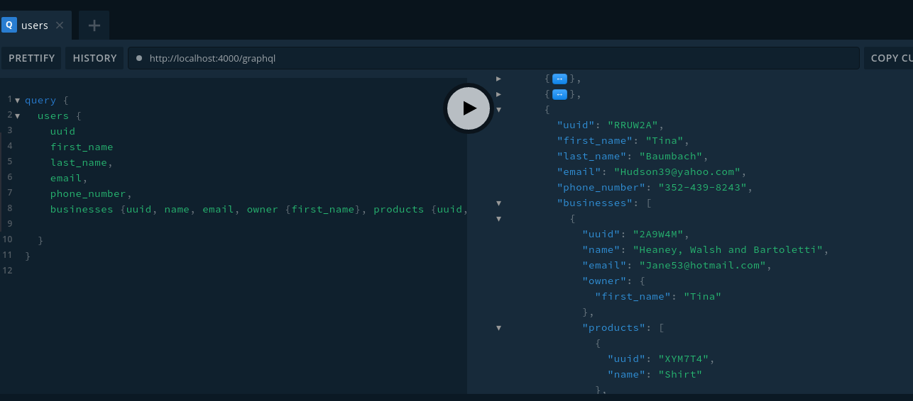
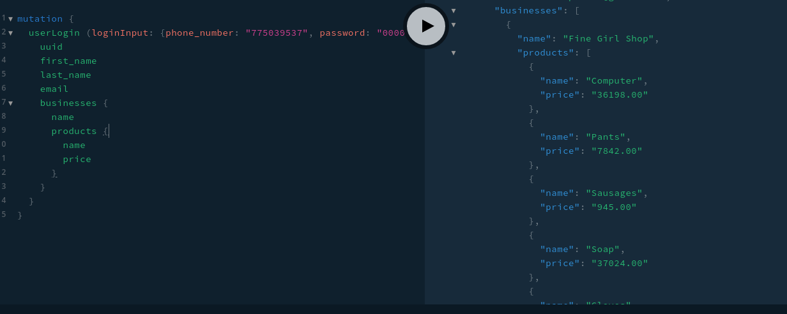
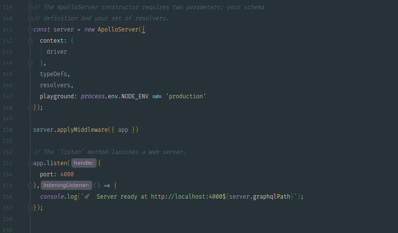
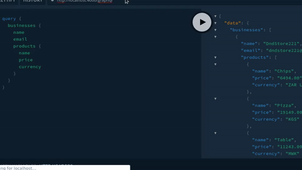
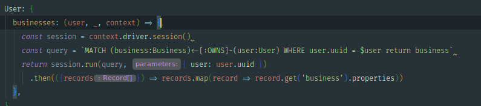
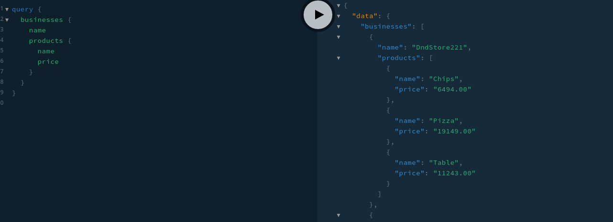

# Why pick GraphQL over REST API (part1)
I am loving the GRANStack so much. I knew about graphql but I was not expecting this to blow my mind this way that I decided to share with you my experience so far.
Don't get me wrong, I am not saying that REST is deprecated but I am saying if you fall under one of these cases you should consider GraphQL over REST API.


## Top situations when you need to consider GraphQL
- you have multiple micro services
- you have complex data
- you want to leverage data relationship (yes I am a graph lover)


## Pros
- request and consume only what you need
    * example
      for querying, ordering whenever you need to change a little something most likely you will need to change something at the back side as well.
      - with REST API with SQL
      ```sql
        -- Today
        SELECT first_name FROM users;
        -- Then tomorrow you need the last_name as well
        SELECT first_name, last_name FROM users;
      ```
      or Mongo
      ```js
        User.find({})
      ```
      - with graphql
      ```graphql
        # Today
        query users {
          first_name
        }
        # When change needed
        query users {
          first_name,
          last_name
        }
        # Back end don't need to change code to satisfy the new query
      ```
      You request what you need
    * less back and forth Server-client
      - let's say you are building a travel agency management system. On the dashboard you may need to:
        * load auth user
        * load airlines
        * load airports
        * load equipments
        * ...so much more load of charts and reporting stuffs
      With graphql you can do it all once
      ```graphql
        query {
          loadAuthUser {
            email,
            name
          }
          loadAirlines {
            # ...
          }
          loadAirports {
            # ...
          }
          loadEquipments {
            # ...
          }
        }
      ```
    * less bandwidth expended
    * (... what are you still reading here, go check it out if you didn't)
    * multiple responses in one query
        - log the user and get businesses owned by that same user 


# Wrap up
Just in a single day I turned my REST API into a graphQL API with as little dependencies and wiring in 150 lines of codes



# Twitter
<blockquote class="twitter-tweet"><p lang="en" dir="ltr"># Why pick GraphQL over REST API<br><br>I am loving the GRANStack so much. I knew about graphql but I was not expecting this to blow my mind this way that I decided to share with you my experience so far.<br><br>1/7 <a href="https://t.co/KVzdAzuoYu">pic.twitter.com/KVzdAzuoYu</a></p>&mdash; Optimus (@babacarcissedia) <a href="https://twitter.com/babacarcissedia/status/1212815026639319045?ref_src=twsrc%5Etfw">January 2, 2020</a></blockquote> <script async src="https://platform.twitter.com/widgets.js" charset="utf-8"></script>


# Why pick GraphQL over REST API (part2)

Previously we did a quick tour of the situations you may be in to consider graphQL over REST but there was few problems to our approach:
- performance: N+1 problem
- security: basically everyone can have access to whatever they want
We will try to fix that today ;)
Let's go!

So far here is what we got


# Performance flaw: N+1 problem
## What is the N+1 problem ?

Let's take the example from the doc where we have books and authors. Querying the books with their respective authors would be:
```graphql
  query {
    books {
      title
      published_at
      author {
        name
      }
    }
  }
```

- Retrieve the books (1)
- retrieve the author for every book (n)
-------------------------------------- Total of n + 1 queries
This is the N+1 problem
In other SQL database it would look something like this
```SQL
  // first query
  SELECT title, published_at, author_id FROM books;

  // n queries
  SELECT name FROM authors
  WHERE id = 1
  SELECT name FROM authors
  WHERE id = 2
  ...
  SELECT name FROM authors
  WHERE id = n
```

You normally wouldn't need that but if you are wondering, he's the schema that I have in my mind
```SQL
  CREATE TABLE authors (
    id INT AUTO_INCREMENT PRIMARY KEY,
    name VARCHAR(100)
  )

  CREATE TABLE books (
    id INT AUTO_INCREMENT PRIMARY KEY,
    title VARCHAR(100),
    published_at DATETIME,
    author_id INT,
    CONSTRAINT fk_books_authors FOREIGN KEY (author_id)
      REFERENCES authors(id)
      ON DELETE CASCADE
      ON UPDATE CASCADE
  )
```

## The solution
### In RDBMS

- Proper way to solve it in relational database in a single query
```SQL
  SELECT b.title, b.published_at, a.name 
  FROM books b, authors a
  WHERE b.author_id IN (
    SELECT id
    FROM authors
    WHERE a.id = b.author_id
  );
```
Since we are using the GRANDStack, there is a plugin to solve this problem right out the box `neo4j-graphql-js`. by @lyonwj developer relationship at neo4j (follow him he has some great contents).
As you can imagine it's neo4j plugin for graphql that solve our N+1 problem
- use neo4j-graphql-js using custom directive with matching cypher query
- You type definition does not change before and after
- resolvers become simpler with

- before:


- after
    * type definition is now a string in backticks
    * make a schema from type definitions
        - A schema is a collection of type definitions (hence "typeDefs") that together define the "shape" of queries that are executed against your data.
    * you no longer need a custom resolver. The neo4j graphql plugin handles it for you. No boilerplate code
```js
import { neo4jgraphql, makeAugmentedSchema } from 'neo4j-graphql-js';
const typeDefs = `
type Business {
    uuid: ID,
    name: String,
    email: String,
    twitter: String,
    instagram: String,
    facebook: String,
    phone_number: String,
    products: [Product] @relation(name: "SELLS", direction: "OUT"),
    owner: User @relation(name: "OWNS", direction: "IN")
}

type Product {
    uuid: ID,
    name: String,
    price: String,
    currency: String,
    unit: String,
    description: String,
    illustrations: [String],
    business: Business @relation(name: "SELLS", direction: "IN")
}
`
const schema = makeAugmentedSchema({typeDefs})
import { ApolloServer } from 'apollo-server';
// don't forget to provide a neo4j driver connection to apollo server
const server = new ApolloServer({ schema, context: { driver } });
```
- results



Just with these 3 lines of codes, you have all the filtering, ordering stuff available alongside with the CRUD operations for your graphql schema

NB: Note that having the end user the ability to query, order and filter datas as they want can be security issue even if you use the option. So restricting the user in the your custom resolvers or middleware can be a way to overcome this flaw.
```js
{ read: true, write: false }
```

Moving along

Notice when I said *a* solution instead of *the* solution
Other way to solve the N+1 problem is by adding a DataLoader
TODO: dataloader
- same as model lazy loading in Laravel
- Basically what it means is you batch the whole requests you have to make and resolve them within a single round trip to the database


# Security flaw
## Using context
```javascript
const schema = makeAugmentedSchema({typeDefs})
import { ApolloServer } from 'apollo-server';
const server = new ApolloServer({ schema, context: ({req}) => ({ driver, req }) });
```

Notice this time that context is a function. It will be called on each request then we delegate the authorization part up to the resolver.
- Pros
    * separation of the responsabilities
- Cons
    * too much boilerplate code

If you are using express another solution would be to use a global auth middleware.
- Pros
    * no boilerplate code
- Cons
    * All or nothing rule. Auth will be applied on each resource or not at all

## GraphQL directives
- @length
- @deprecated
- @auth
- @hasRole(role: $role)

### How ?
const server = new ApolloServer({
  typeDefs,
  resolvers,
  `schemaDirectives: {
    length: LengthDirective,
  },
});

### @auth
1. The context function on your ApolloServer instance is called with the request object each time a GraphQL operation hits your API. Use this request object to read the authorization headers.
2. Authenticate the user within the context function.
3. Once the user is authenticated, attach the user to the object returned from the context function. This allows us to read the user's information from within our data sources and resolvers, so we can authorize whether they can access the data.
  context: ({ req }) => async ({
    const authHeader = req.headers.authorization
    if (authHeader) {
        const [_, token] = authHeader.split(' ')
        // Request now have instance of the auth user just like you would do in an express app
        req.user = await User.find({ token })
    }
  })

### @hasRole
    directive @hasRole(
      requires: Role = ADMIN,
    ) on OBJECT | FIELD_DEFINITION

    enum Role {
      ADMIN
      REVIEWER
      USER
      UNKNOWN
    }

    type User @hasRole(requires: USER) {
      name: String
      banned: Boolean @hasRole(requires: ADMIN)
      canPost: Boolean @hasRole(requires: REVIEWER)
    }

We've just defined a direction @hasRole with default value ADMIN. The directive can be applied to OBJECT () or FIELD_DEFINITION ()

Additional resources at https://www.apollographql.com/docs/apollo-server/schema/creating-directives/

## Security using directives

- permission
    * using roles
    * using scope i.e ['user.write']

Most likely you will come in a situation where you want to restrict a resource of your API. GraphQL does not have any opinion on how you should implement auth. It just provides a context object available in each resolver.
